# Amazon Market Intelligence

**What actually drives product success on Amazon — and can we turn that knowledge into a tool that helps sellers make better decisions?**

I took 37 GB of raw Amazon product data and 526M customer reviews, built a full intelligence pipeline, discovered what actually drives success on the world's biggest marketplace, and turned it into a tool that any seller can use to make better decisions.

---

## The Problem

Amazon sellers make pricing, positioning, and category decisions blindly. "Cheap wins" is conventional wisdom. "More reviews = more sales" is assumed. "Just get the Best Seller badge" is the dream. **None of it holds up across all categories.**

## The Data

| Source | What | Scale |
|--------|------|-------|
| Kaggle Amazon Products | Products with prices, ratings, sales, Best Seller flags | 1.4M products |
| Kaggle Amazon Categories | Category taxonomy | 248 subcategories |
| McAuley Lab Metadata | Products with stores, brands, features, descriptions | 35M products |
| McAuley Lab Reviews | Review text, ratings, timestamps, user IDs | 526M reviews |

**Total raw data: ~200+ GB across 4 sources.**

---

## What I Discovered

### "Cheap wins" is dead.

Budget wins only **6 of 248** subcategories. Luxury earns **$6,624 per product** — 19× more than Budget. The winning price tier is entirely category-dependent.

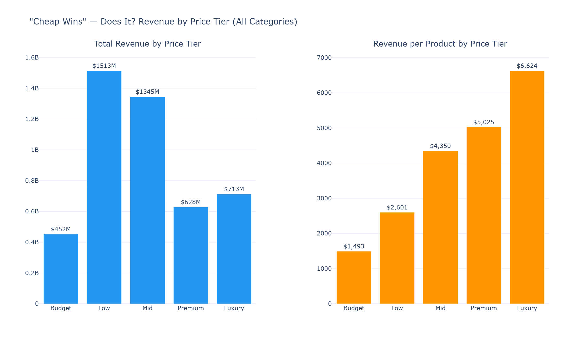

Not all categories are created equal. The **Opportunity Quadrant** maps every subcategory by demand density vs. activity rate — top-right with a small bubble is the sweet spot.

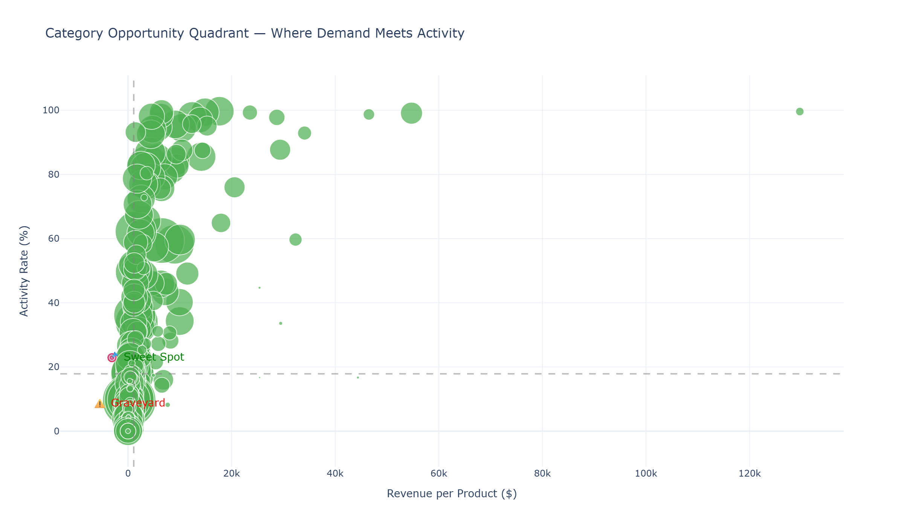

Light discounts (1-19%) dominate **144 categories**. Deep discounts (50%+) win only 4. No-discount products earn the most per listing ($7,903). The discount sweet spot is much lighter than most sellers think.

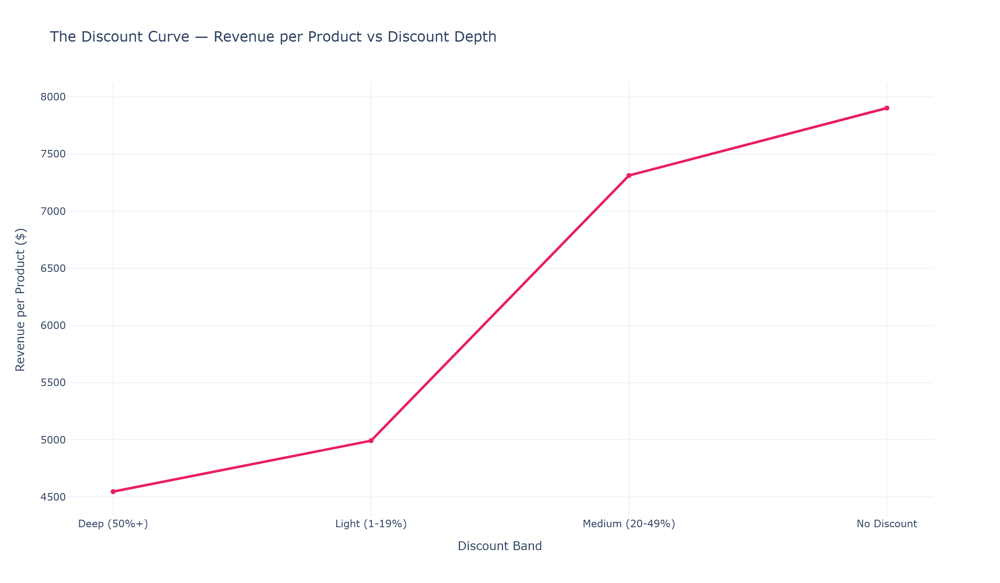

### Price positioning is the #1 success predictor.

XGBoost + SHAP on 497K products: `price_rank` within subcategory has 3× the predictive power of any other feature. Bottom quintile = 10% success rate. Top quintile = 52%. SHAP waterfall plots show exactly why each product succeeds or struggles.

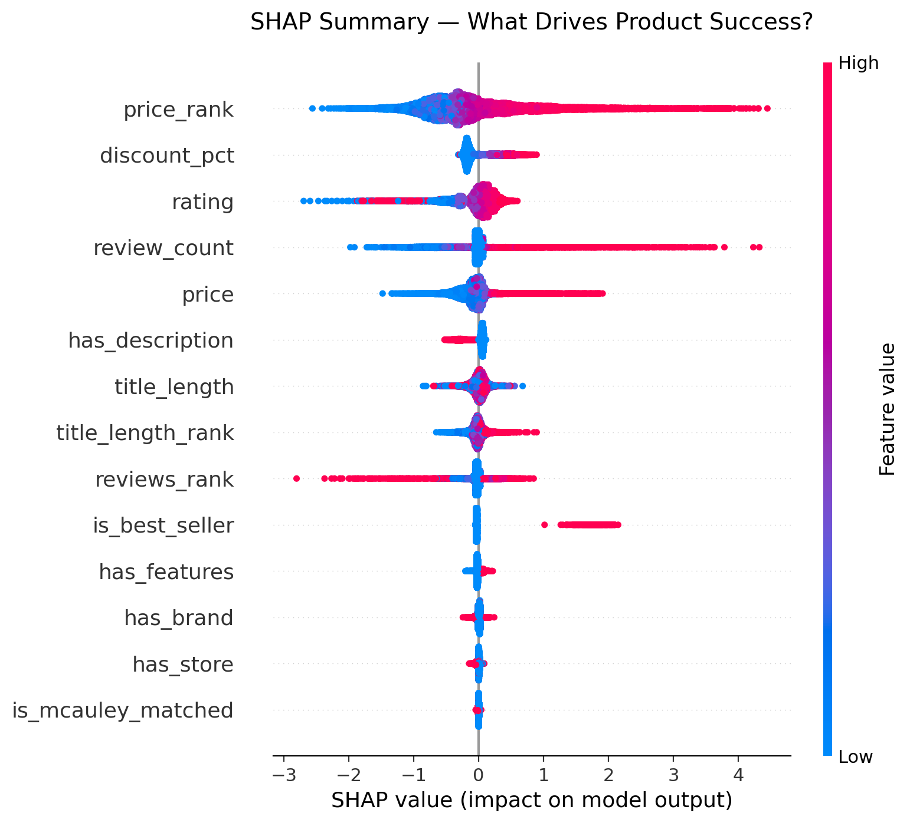

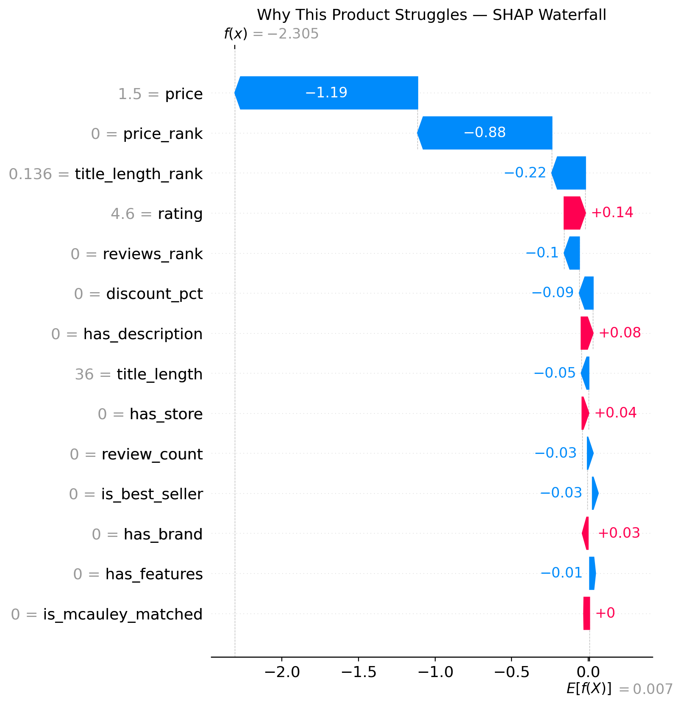

The model achieves **AUC 0.78** — listing attributes predict most of success, but ~22% is marketplace randomness that no listing optimization can control.

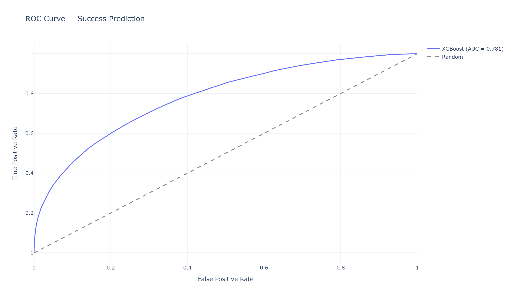

### The "fake review" narrative doesn't hold — except when it does.

89.2% of reviews are verified purchases. Market-wide, unverified reviewers give **fewer** 5-star ratings than verified ones (−8.6pp gap). But on the 5% of products flagged by Isolation Forest, the pattern **reverses** — unverified reviews inflate ratings. Manipulation exists, but it's targeted, not systemic.

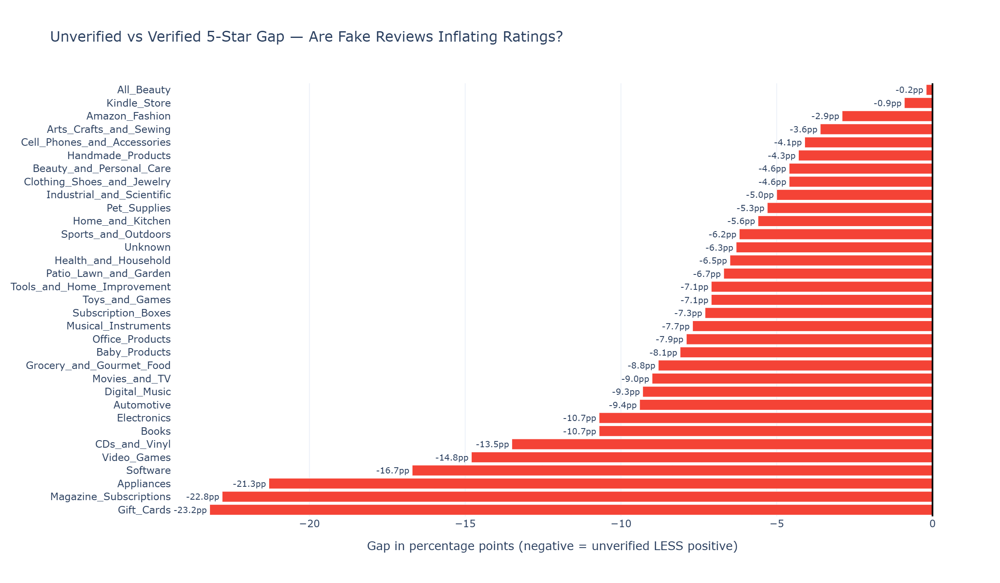

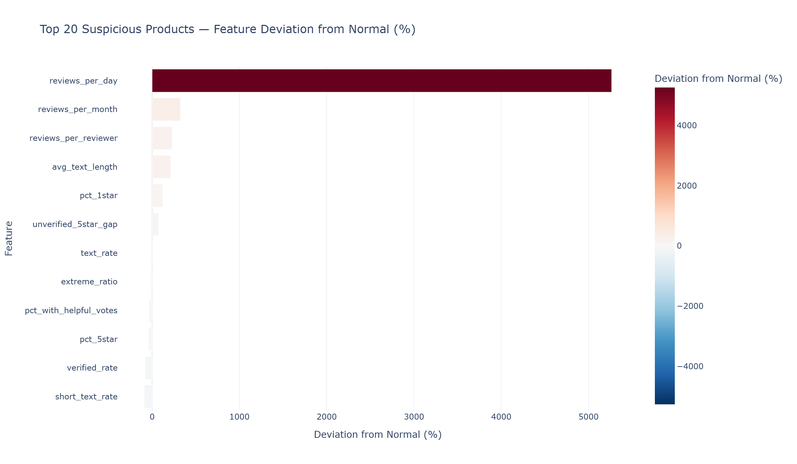

### Five competitive archetypes define the marketplace.

K-Means clustering on category-relative features reveals five product types. **Best Seller Elite (1.4%)** earns $63,457 per product — 18× more than Quiet Quality. **Silent Volume Movers (29%)** sell 774 units/month with near-zero reviews. Keyword-stuffed titles (Struggling Listers) correlate with the worst ratings.

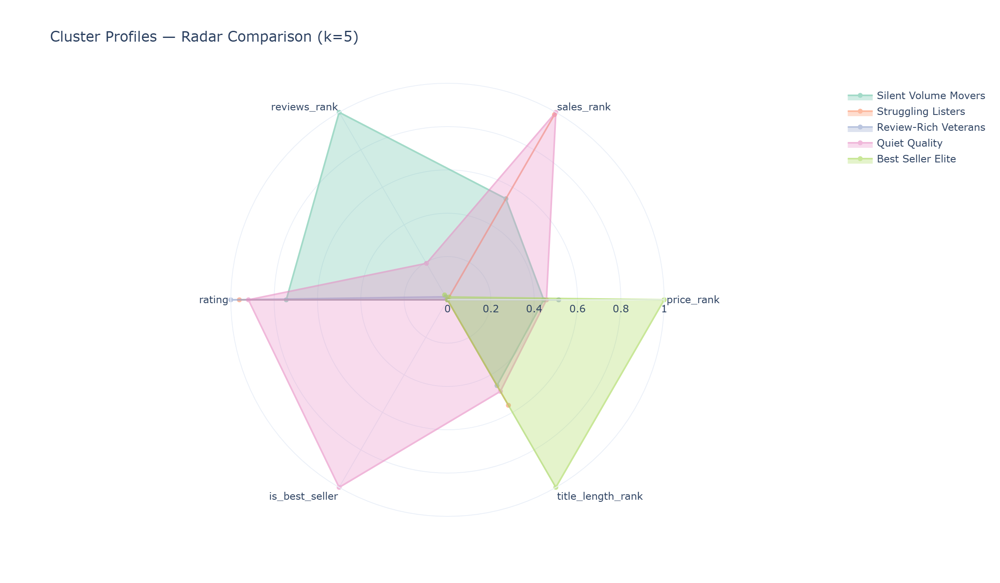

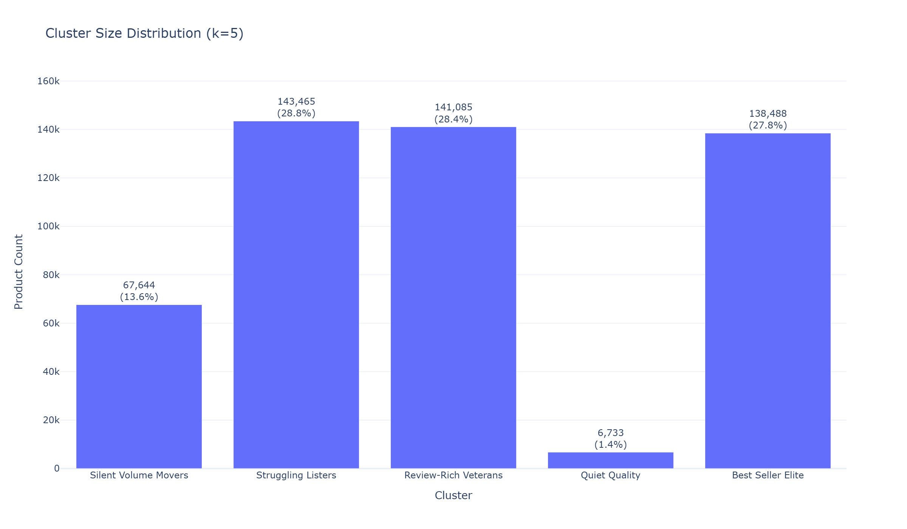

PCA reveals two axes: **PC1 = success** (sales + badge + reviews), **PC2 = effort vs quality** (title length vs rating). Best Seller Elite separates cleanly; Struggling Listers cluster high on the effort axis.

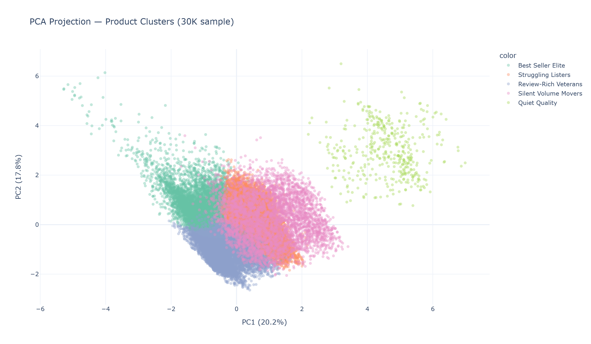

### Specialization beats diversification. Always.

54% of stores sell exactly one product. Specialists earn **44% more per product** than Generalists. But the top 1.2% of stores hold 50% of all revenue. Store ratings have near-zero correlation with revenue (0.036).

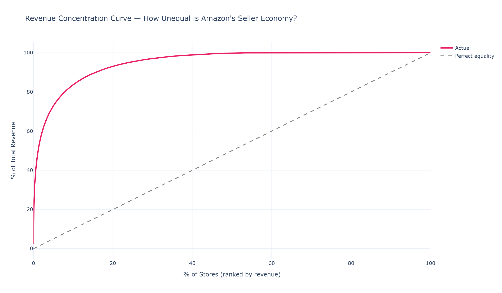

### Complaint keywords need ratios, not frequency.

Raw word frequency shows "product" and "good" as top complaint words — useless. Dividing negative frequency by positive reveals real signals: **"inedible" (699×), "rancid" (396×), "unsafe" (226×)**.

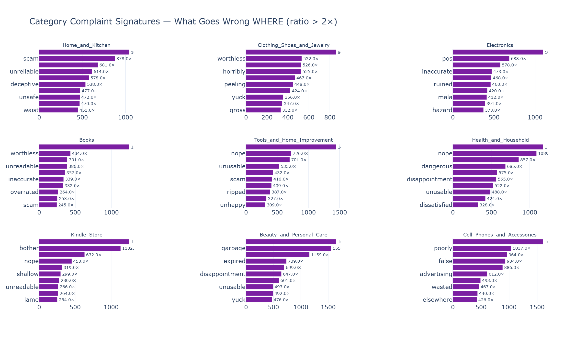

---

## Full Analysis Details

| # | Notebook | Charts | Key Finding |
|---|----------|--------|-------------|
| [03](notebooks/03_category_landscape.ipynb) | Category Landscape | 14 | Kitchen & Dining leads at $267M; ratings declining 4.28→4.02 |
| [04](notebooks/04_pricing_discounts.ipynb) | Pricing & Discounts | 11 | Light discounts (1-19%) dominate 144 categories; deep discounts win only 4 |
| [05](notebooks/05_brand_listing_quality.ipynb) | Brand & Listing Quality | 10 | Brand multiplier: 206× (Sony PSP) to ~0; listing completeness median <1× |
| [06](notebooks/06_store_seller_patterns.ipynb) | Store & Seller Patterns | 10 | Top 1.2% of stores hold 50% revenue; rating-revenue correlation 0.036 |
| [07](notebooks/07_reviews_sentiment.ipynb) | Reviews & Sentiment | 14 | 526M reviews; unverified less generous; complaint ratios > raw frequency |
| [08](notebooks/08_competitive_clustering.py) | ML: Competitive Clustering | 10 | 5 archetypes; Best Seller Elite 1.4% earns 18× more per product |
| [09](notebooks/09_success_factors.py) | ML: Success Factors | 11 | AUC 0.78; price_rank is #1 predictor; rating cliff at 4.0 |
| [10](notebooks/10_review_anomaly.py) | ML: Review Anomaly | 10 | 5% flagged; verified rate #1 signal; manipulation reverses market pattern |

**Total: 90 charts, ~100 findings, 8 analysis notebooks.**

---

## Architecture

```
Bronze → Silver → Gold → Notebooks → ML → Streamlit App
```

- **Bronze (4 tables):** Raw ingestion — 1.4M products, 35M metadata, 248 categories, 526M reviews
- **Silver (5 tables/views):** Cleaned, typed, enriched — quality flags, joins, deduplication
- **Gold (18 tables):** Pre-aggregated analytics + ML outputs — one table per question
- **Engine:** DuckDB (local, no cloud dependency, handles 200+ GB)
- **Stack:** Python · DuckDB · Pandas · Plotly · scikit-learn · XGBoost · SHAP · Streamlit

## The Tool (In Progress)

**5 modes, 11 customer questions:**

| Mode | Questions It Answers |
|------|---------------------|
| 🔍 Category Scout | Where should I sell? Is my category growing? How competitive is it? |
| 📊 Competitive Positioning | What's the price sweet spot? Who are my competitors? |
| 🏥 Health Check | How does my product compare? What am I doing wrong? |
| 💬 Voice of Customer | What are customers actually saying? |
| 🛡️ Review Trust Score | Can I trust these reviews? |

## Project Structure

```
amazon-market-intelligence/
├── collection/           # Raw data files (not in repo)
├── pipeline/             # Bronze → Silver → Gold scripts
│   ├── bronze_*.py       # 4 Bronze ingestion scripts
│   ├── silver_*.py       # 5 Silver transform scripts
│   └── gold_*.py         # 11 Gold aggregation scripts
├── notebooks/            # Analysis & ML notebooks
│   ├── 01-02             # EDA (Kaggle + McAuley)
│   ├── 03-07             # Exploratory analysis (59 charts)
│   ├── 08-10             # ML notebooks (31 charts)
│   └── charts/           # Generated visualizations
├── models/               # Trained ML models (3 artifacts)
├── app/                  # Streamlit application
└── data/                 # DuckDB database (not in repo)
```

## Progress

- [x] Bronze → Silver → Gold pipeline (18 tables)
- [x] Exploratory analysis (5 notebooks, 59 charts)
- [x] ML: Competitive Clustering (K-Means — 5 archetypes)
- [x] ML: Success Factor Discovery (XGBoost + SHAP — AUC 0.78)
- [x] ML: Review Anomaly Detection (Isolation Forest — 5% flagged)
- [ ] Streamlit interactive tool
- [ ] Presentation deck

---

*Built by Poi — data professional in transition, 8 months into a Data Analyst → Data Scientist program. This project demonstrates end-to-end data engineering, analysis, and ML on 200+ GB of real-world data.*
