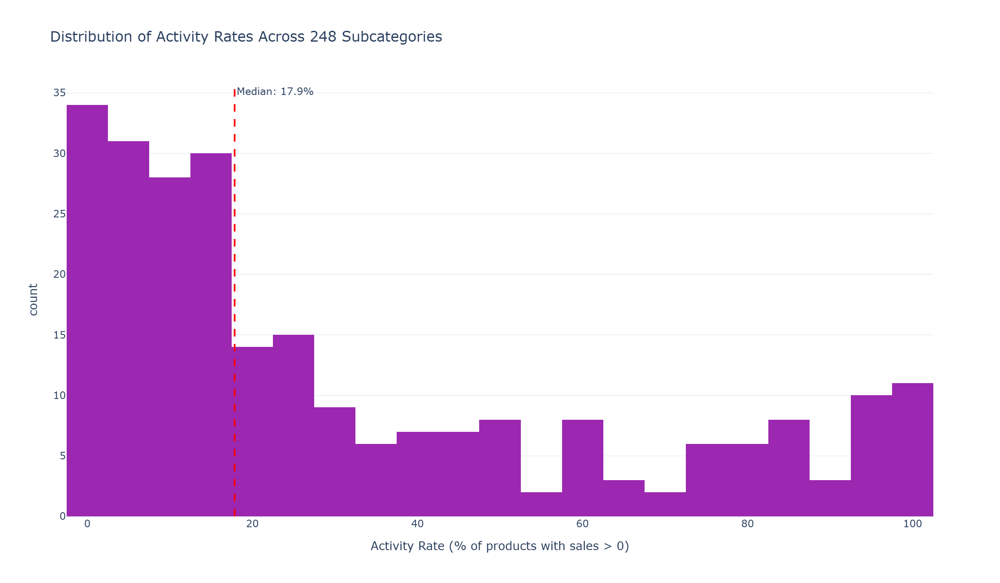
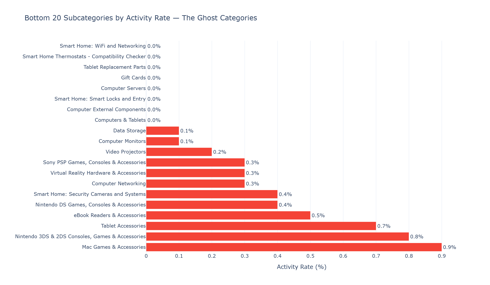
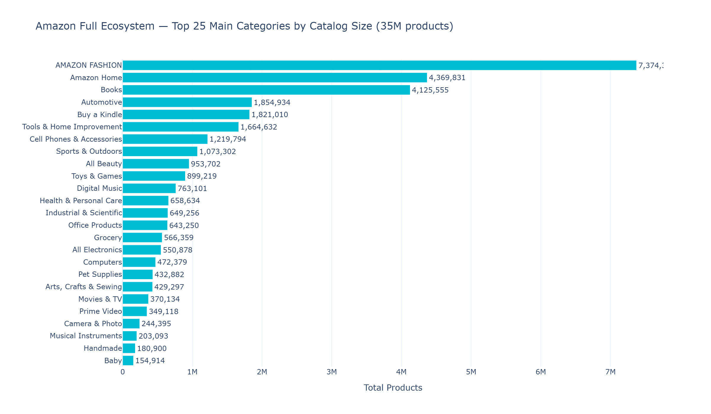
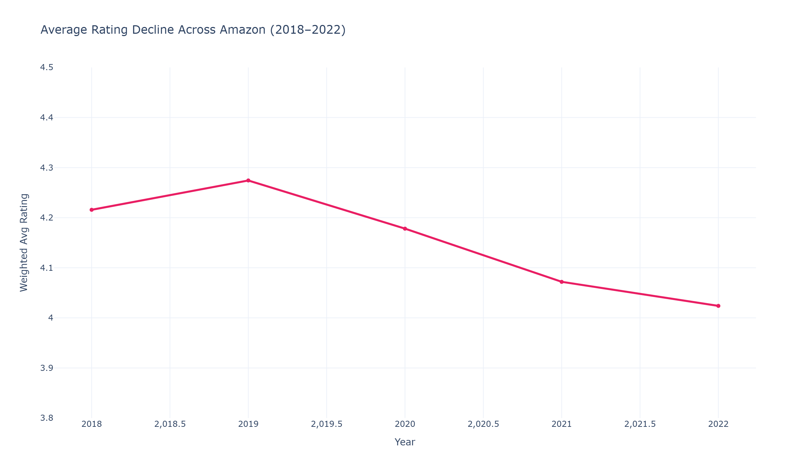
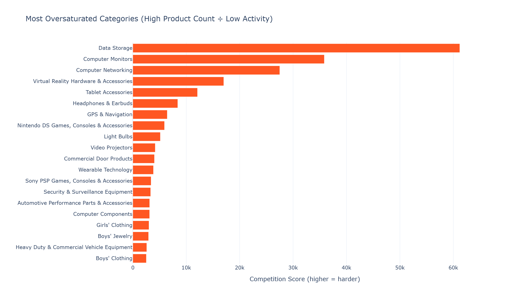
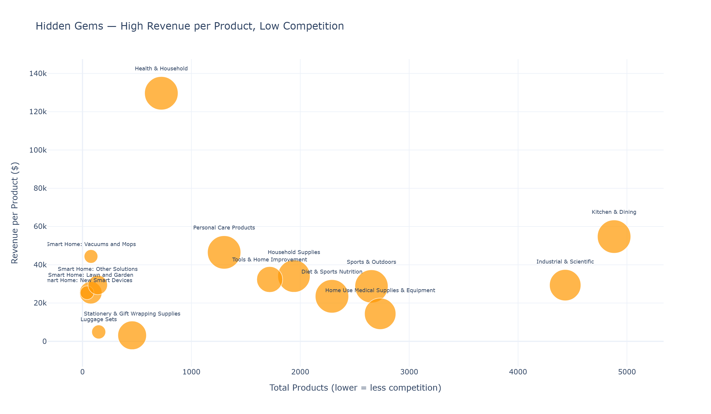
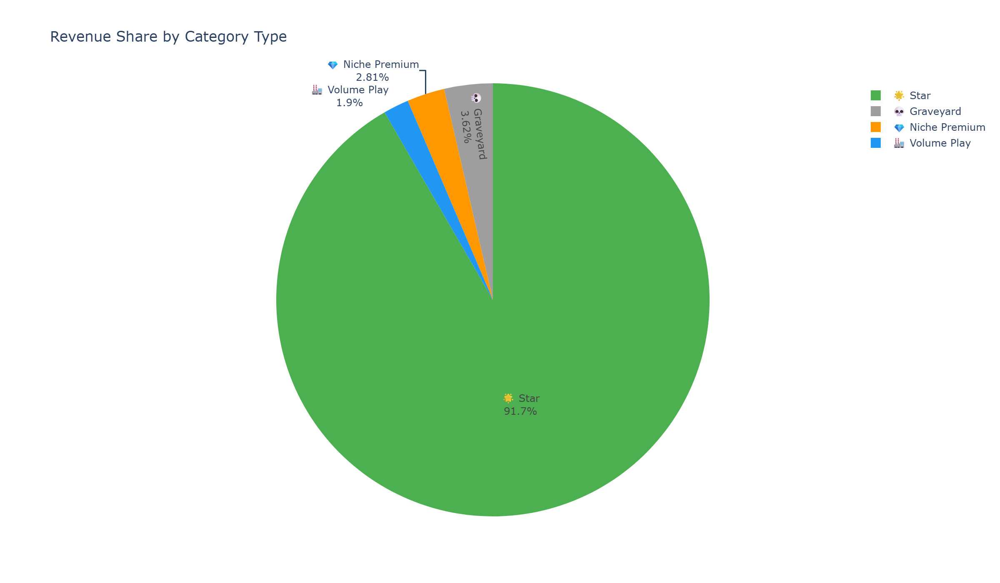

# Amazon Market Intelligence

**What actually drives product success on Amazon — and can we turn that knowledge into a tool that helps sellers make better decisions?**

I took 37 GB of raw Amazon product data and 526M customer reviews, built a full intelligence pipeline, discovered what actually drives success on the world's biggest marketplace, and turned it into a tool that any seller can use to make better decisions.

---

## The Problem

Amazon sellers make pricing, positioning, and category decisions blindly. "Cheap wins" is conventional wisdom. "More reviews = more sales" is assumed. "Just get the Best Seller badge" is the dream. **None of it holds up across all categories.**

## The Data

| Source | What | Scale |
|--------|------|-------|
| Kaggle Amazon Products | Products with prices, ratings, sales, Best Seller flags | 1.4M products |
| Kaggle Amazon Categories | Category taxonomy | 248 subcategories |
| McAuley Lab Metadata | Products with stores, brands, features, descriptions | 35M products |
| McAuley Lab Reviews | Review text, ratings, timestamps, user IDs | 526M reviews |

**Total raw data: ~200+ GB across 4 sources.**

---

## Key Findings

### Where the Money Is

Not all categories are created equal. Kitchen & Dining alone generates **$267M** in estimated revenue — more than the bottom 100 subcategories combined.


### But Raw Revenue Is Misleading

Revenue *per product* tells the real story. Some small categories concentrate more demand per listing than massive ones.


### The Opportunity Quadrant

Every subcategory plotted by demand density vs. activity rate. Bubble size = competition level. **Top-right, small bubble = the sweet spot.**


### Most of Amazon Is Dead

The majority of subcategories have surprisingly low activity rates — most listed products never sell.



### The Ghost Categories

These subcategories have the lowest activity — massive catalogs where almost nothing moves.



### Full Ecosystem: 35M Products Across 50 Categories

Zooming out to the complete Amazon catalog from McAuley metadata — not just products with sales data.



### Ratings Are Declining Industry-Wide

Average ratings dropped from 4.28 to 4.02 between 2019–2022. Customers are getting pickier — or quality is declining.



### Who's Growing, Who's Dying

Compound annual growth rate of review volume by category. Green = growing markets. Red = shrinking ones.


### Category Growth Heatmap

Year-over-year review volume change across all categories.


### The Most Oversaturated Markets

High product count ÷ low activity = brutal competition with little payoff.



### Hidden Gems

High revenue per product, low competition. These are the categories worth entering.



### Category Typology

Every subcategory classified into one of four strategic types:

| Type | Revenue/Product | Activity | What It Means |
|------|----------------|----------|---------------|
| 🌟 Star | High | High | Money is here, things sell |
| 💎 Niche Premium | High | Low | Few sell but those that do earn big |
| 🏭 Volume Play | Low | High | Things sell but margins are thin |
| 💀 Graveyard | Low | Low | Dead listings, nobody buys |




---

## Validated Insights (So Far)

- **"Cheap wins" is false** — in Kitchen & Dining, luxury products earn 18× more per product than budget
- **Brand advantage is category-dependent** — ranges from 207× (Sony PSP) to near-zero
- **Specialization beats diversification** — specialists earn 44% more revenue per product
- **Best Seller badge impact ranges from 132× to negligible** depending on category
- **Listing completeness multiplies revenue up to 27×**
- **Medium discounts (20–49%) outperform deep discounts**
- **Ratings are declining industry-wide** (4.28 → 4.02, 2019–2022)
- **Unverified reviews are less positive than verified** — the opposite of what you'd expect
- **29% of products have review matches** — clothing categories worst at ~1%

---

## Architecture

```
Bronze → Silver → Gold → Notebooks → ML → Streamlit App
```

- **Bronze (4 tables):** Raw ingestion — 1.4M products, 35M metadata, 248 categories, 526M reviews
- **Silver (5 tables/views):** Cleaned, typed, enriched — quality flags, joins, deduplication
- **Gold (16 tables):** Pre-aggregated analytics — one table per analytical question
- **Engine:** DuckDB (local, no cloud dependency, handles 200+ GB)
- **Stack:** Python · DuckDB · Pandas · Plotly · scikit-learn · XGBoost · VADER · Streamlit

## The Tool (In Progress)

**5 modes, 11 customer questions:**

| Mode | Questions It Answers |
|------|---------------------|
| 🔍 Category Scout | Where should I sell? Is my category growing? How competitive is it? |
| 📊 Competitive Positioning | What's the price sweet spot? Who are my competitors? |
| 🏥 Health Check | How does my product compare? What am I doing wrong? |
| 💬 Voice of Customer | What are customers actually saying? |
| 🛡️ Review Trust Score | Can I trust these reviews? |

---

## Project Structure

```
amazon-market-intelligence/
├── collection/           # Raw data files (not in repo)
├── pipeline/             # Bronze → Silver → Gold scripts
│   ├── bronze_*.py       # 4 Bronze ingestion scripts
│   ├── silver_*.py       # 5 Silver transform scripts
│   └── gold_*.py         # 11 Gold aggregation scripts
├── notebooks/            # Analysis & ML notebooks
│   ├── 01_eda_kaggle.ipynb
│   ├── 02_eda_mcauley_metadata.ipynb
│   ├── 03_category_landscape.ipynb
│   └── charts/           # Generated visualizations
├── models/               # Trained ML models
├── app/                  # Streamlit application
└── data/                 # DuckDB database (not in repo)
```

## What's Next

- [ ] Pricing & Discount Analysis
- [ ] Brand & Listing Quality Analysis
- [ ] Store & Seller Patterns
- [ ] Review & Sentiment Analysis (VADER NLP)
- [ ] ML: Competitive Clustering (K-Means)
- [ ] ML: Success Factor Discovery (XGBoost + SHAP)
- [ ] ML: Review Anomaly Detection
- [ ] Streamlit interactive tool
- [ ] Presentation deck

---

*Built by Poi — data professional in transition. This project is part of a 10-month Data Analyst → Data Scientist program.*
